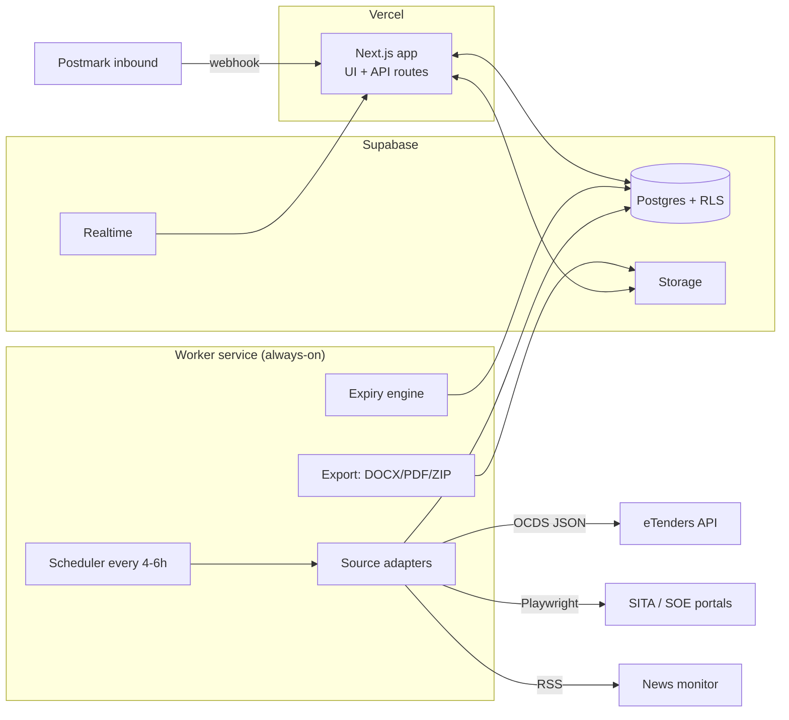

# Pipeline — Implementation Plan

Deliverable for the "PLAN MODE" section of `pipeline-master-prompt.md`.
Status: **awaiting approval before M1.**

Findings marked **[verified]** were probed live on 2 Aug 2026 and the evidence is in
§3. Everything else is a proposal open to challenge.

---

## 1. Architecture & stack decision

### 1.1 Background jobs — no separate worker service needed

I initially proposed splitting the intake workers onto an always-on Node service, on the
assumption that SITA would need Playwright. **The spike disproved that** (§3.2), so the
recommendation is now the simpler one: keep the prompt's original approach and run the
adapters as scheduled serverless jobs. No extra infrastructure, no extra cost.

The two things that would have forced a container both turned out to be avoidable:

- **Headless browsers — not required.** Every source in scope is either a JSON API or
  server-rendered HTML **[verified]**. Nothing needs a browser.
- **DOCX → PDF.** Headless LibreOffice gives the best fidelity but needs a container.
  Generating the PDF directly instead costs some parity between the DOCX and PDF outputs
  and removes the requirement. Taken at M5.

Two consequences to respect rather than discover later: the whole run must stay inside
Vercel's function ceiling, so adapters run as one scheduled job per source rather than a
single loop over all of them; and serverless egress IPs rotate, so every scraped source
is rate-limited and cached, and none is on a critical path.

Revisit only if a future SOE portal turns out to need a browser.

Everything else in the proposed stack I accept.

### 1.2 Final stack

| Layer | Choice | Note |
|---|---|---|
| Web | Next.js 14+ App Router, TypeScript, Tailwind | as proposed |
| DB | Postgres via Supabase | as proposed |
| Auth / RLS | Supabase Auth + row-level security | as proposed |
| Files | Supabase Storage, private buckets, signed URLs | as proposed |
| Realtime | Supabase Realtime (chat, board moves) | as proposed |
| ORM | **Drizzle** | SQL-first, migrations in git, composes with RLS. Prisma is a fine substitute if the team already knows it — say the word |
| Worker | **Vercel Cron**, one scheduled job per source | see §1.1 — no separate service |
| Inbound email | **Postmark inbound** → webhook | parsed JSON incl. attachments; needs a subdomain you control |
| DOCX | `docx` | as proposed |
| PDF merge | `pdf-lib` | merges compliance packs |
| DOCX→PDF | headless LibreOffice in the worker | fidelity |
| ZIP | `archiver` | as proposed |
| Search | Postgres `tsvector` + GIN + `unaccent` | no extra infra at 2–10 users |

### 1.3 Shape



---

## 2. Database schema

Grouped by module. Types shortened; every table gets `id uuid pk`, `created_at`,
`updated_at` unless noted.

### Identity & audit
- **`profiles`** — `user_id`→auth.users, `display_name`, `role` (`admin|member|viewer`), `avatar_path`
- **`company_profile`** — singleton: `name`, `reg_no`, `csd_no`, `tax_pin`, `vat_no`, `bbbee_level`, `address`, `bank_details`
- **`audit_log`** — `actor_id`, `entity_type`, `entity_id`, `action`, `diff jsonb`, `at`

### Intake
- **`sources`** — `key`, `name`, `sector` (`public|private`), `base_url`, `adapter_key`, `enabled`, `interval_minutes`, `last_run_at`, `last_status`, `config jsonb`
- **`source_runs`** — `source_id`, `started_at`, `finished_at`, `status`, `items_found`, `items_new`, `error_text`
- **`source_records`** — `source_id`, `external_id`, `raw jsonb`, `content_hash`, `url`, `fetched_at`, `opportunity_id` (nullable)
- **`buyers`** — `name`, `normalized_name`, `type` (`national|provincial|municipal|soe|private`), `province`
- **`opportunities`** — `ref_no`, `ref_no_normalized`, `buyer_id`, `sector`, `source_id`, `title`, `description`, `lanes text[]`, `closing_at timestamptz`, `briefing_at`, `briefing_compulsory`, `briefing_venue`, `estimated_value_cents`, `currency`, `source_url`, `stage`, `owner_id`, `win_probability`, `relevance_score`, `is_lead bool`, `procurement_method`
- **`opportunity_revisions`** — `opportunity_id`, `source_record_id`, `kind` (`amendment|erratum|extension`), `changed_fields jsonb`, `detected_at`
- **`checklist_items`** — `opportunity_id`, `label`, `required bool`, `done bool`, `file_id`
- **`lane_keywords`** — `lane`, `term`, `weight`, `is_negative bool`

> **`source_records` is deliberately separate from `opportunities`.** The same tender
> appears on eTenders *and* the Government Tender Bulletin; the prompt's "dedupe by
> reference number" needs a many-records-to-one-card model to express that, plus it gives
> amendment detection somewhere to live (see §3.3).

### Private sector (M10)
- **`portal_watchlist`** — `company_name`, `portal_url`, `industry`, `registration_status` (`not_registered|pending|registered|expired`), `account_ref`, `renewal_due_on`, `has_adapter bool`, `last_checked_at`, `notes`
- **`news_feeds`** — `name`, `feed_url`, `enabled`
- **`news_signals`** — `feed_id`, `title`, `url`, `published_at`, `matched_terms text[]`, `lanes text[]`, `buyer_guess`, `promoted_opportunity_id`

### CRM
- **`contacts`** — `buyer_id`, `name`, `role`, `email`, `phone`, `notes`
- **`interactions`** — `contact_id`, `opportunity_id`, `type` (`call|email|meeting|referral`), `occurred_at`, `notes`, `user_id`

### Delivery & finance
- **`projects`** — won work: `opportunity_id`, `name`, `starts_on`, `ends_on`, `status`, `value_cents`
- **`invoices`** — `number`, `buyer_id`, `project_id`, `amount_cents`, `issued_on`, `due_on`, `paid_on`, `status` (`draft|sent|paid|overdue`)

### Compliance
- **`document_types`** — `key`, `name`, `validity_months` (null = no expiry), `validity_rule jsonb`, `required_by_default bool`
- **`compliance_documents`** — `document_type_id`, `file_id`, `issued_on`, `expires_on`, `version`, `superseded_by_id`, `uploaded_by`, `notes`
- **`bid_packs`** — `opportunity_id`, `file_id`, `included_document_ids uuid[]`, `had_expiry_warning bool`, `created_by`

`expires_on` is computed on write from `issued_on` + the type's rule; status
(Valid / Expiring soon / Expired) is derived at read time so it never goes stale.

### Proposals
- **`proposal_templates`**, **`template_blocks`** (`kind`, `title`, `body`, `sort`)
- **`proposals`** — `opportunity_id`, `template_id`, `title`, `status` (`draft|review|approved`), `version`, `created_by`, `approved_by`
- **`proposal_sections`** — `proposal_id`, `title`, `body`, `sort`
- **`proposal_comments`** — `proposal_id`, `section_id`, `user_id`, `body`, `resolved bool`

### Chat / discussions / calendar / files
- **`channels`** (`name`, `kind` `public|private|dm|opportunity`, `opportunity_id`), **`channel_members`** (`last_read_at`), **`messages`** (`channel_id`, `parent_id`, `user_id`, `body`, `edited_at`), **`reactions`**
- **`topic_categories`**, **`topics`** (`category_id`, `title`, `body`, `pinned`, `solved_post_id`, `opportunity_id`, `project_id`), **`posts`**
- **`events`** (`kind` `meeting|briefing|closing`, `title`, `starts_at`, `ends_at`, `video_url`, `agenda`, `opportunity_id`), **`event_attendees`**
- **`files`** — `bucket_path`, `filename`, `mime`, `size`, `entity_type`, `entity_id`, `version`, `supersedes_id`, `uploaded_by`
- **`search_index`** — `entity_type`, `entity_id`, `title`, `body`, `tsv tsvector` (GIN)

Briefing and closing dates are **projected into `events`** by trigger, so the calendar
auto-populates rather than needing a second sync path.

---

## 3. Intake, per source

### 3.1 eTenders — solved, no scraper needed **[verified]**

`https://ocds-api.etenders.gov.za/api/OCDSReleases?PageNumber=&PageSize=&dateFrom=&dateTo=`
returns **HTTP 200, OCDS 1.1 JSON**, published by National Treasury and licensed
**PDDL 1.0 (public domain)**. That licence removes the terms-of-use risk for our single
most important source.

The field mapping is almost exactly our card:

| OCDS field | Opportunity field |
|---|---|
| `tender.id` / `tender.title` | ref no / title |
| `tender.procuringEntity.name` | buyer |
| `tender.tenderPeriod.endDate` | **closing date & time** |
| `tender.briefingSession.{isSession,compulsory,date,venue}` | briefing block |
| `tender.documents[]` | document links |
| `tender.value.amount` | estimated value |
| `tender.category`, `province`, `procurementMethodDetails` | tags |

Pagination is `links.next` only — no total count — so the adapter walks until an empty
page. Two caveats found in the sample: `value.amount` is frequently `0` (treat as
unknown, not free), and `mainProcurementCategory` is often empty.

**Categories are not lane-aligned.** The 18 releases sampled bucketed into broad SIC
groups — "Construction", "Services: Professional", "Electricity, gas, steam and air
conditioning" — with no ICT category at all. So category is a weak signal and the
keyword scorer over title + description is doing the real work, not an optimisation.

### 3.2 The others

| Source | Approach | Confidence |
|---|---|---|
| **SITA** | **Solved — plain HTML, no browser.** Two feeds, see below | High **[verified]** |
| **CSD** | Email-in only. Postmark inbound → parser → card | High |
| **Eskom** | WordPress; `robots.txt` allows everything but `/wp-admin/` **[verified]**. Cheerio + sitemap | High |
| **Transnet / SANRAL / PRASA / etc.** | One adapter each, added after the pattern is proven | Low until surveyed |
| **Provincial / municipal** | Configurable; most republish to eTenders, so start by measuring overlap before writing any adapter | Medium |
| **SAP Business Network Discovery** | Category alert emails → same email-in pipeline. No public API without a paid account | Medium |
| **Corporate watchlist** | Mostly manual status tracking; adapters only where a public opportunities page exists | High |
| **News monitor** | RSS + keyword → `news_signals`, promoted to a card by hand | High |

Neither SITA nor eTenders serves a `robots.txt` at all (both 404 **[verified]**). Absence
of a prohibition is not permission, so anything scraped stays rate-limited, cached,
identified by a real user-agent, and off the critical path.

#### SITA — spike result **[verified]**

My first read was wrong. `www.sita.co.za/content/invitations` looked JavaScript-rendered,
but those 30 script tags are Drupal and jQuery theme boilerplate; the page is an **iframe
wrapper**. The data lives on a separate classic-ASP host, server-rendered, and parses
with Cheerio. Anything scraping `www.sita.co.za` directly would find nothing.

Two distinct feeds, both needed — tenders and RFQs are separate systems:

| Feed | URL | Rows | Yield |
|---|---|---|---|
| Tenders (RFB) | `rfq.sita.co.za/TendersAdministration/invitations.asp` | 220 | ref, title, closing date, published date, docs |
| RFQs | `rfq.sita.co.za/RFQ/RFQInvitations.asp` | 188 | ref, title, closing date, published date, client id, docs |

Also on that host: `RFQsearch.asp` (form: `rfq_year`, `rfq_number`, `rfqclientid`) and
`RFQBilletinsSelect.asp` — note SITA's own typo in that filename, which is a good
illustration of how brittle these URLs are.

Document downloads are POST forms carrying `rfq_number` (or `tender_number`) plus
`view_name`, so fetching attachments means replaying the form, not following a link.

The prompt's claim that SITA is the highest-value source for the ICT lane is borne out by
the live sample: Cisco unified comms, network switches, Apple hardware, RSA SecurID,
Trend Micro, emulation software licences.

**One trap.** The listings are not purged — the RFQ feed carries entries that closed in
2025 alongside current ones **[verified]**. The adapter must filter on closing date and
must not treat "present on the page" as "open", or the board fills with dead work.

### 3.3 Adapter interface, dedupe, failure

```ts
interface SourceAdapter {
  key: string;
  sector: 'public' | 'private';
  fetch(since: Date): AsyncIterable<RawRecord>;   // paginate internally
  normalise(raw: RawRecord): NormalisedOpportunity;
}
```

Core pipeline, identical for every adapter: `fetch → normalise → hash → dedupe → match → persist → notify`.

**Dedupe** is not a plain reference-number equality — formats differ per source. Key is
`normalize(ref_no)` (upper, strip spaces/punctuation) **plus** fuzzy buyer name **plus**
closing date within 24h. A hit attaches a new `source_record` to the existing card
instead of creating a second one.

**Amendments**: each record carries a `content_hash`. On re-fetch, a changed hash writes
an `opportunity_revision` with the field diff and flags the card — which is how closing-date
extensions get caught, the failure mode that actually costs you a bid.

**Failure**: per-source circuit breaker with exponential backoff. A source that is down
is marked degraded and surfaced in Settings; it never blocks the run or silently empties
the board. Cards are never auto-deleted because a fetch failed.

---

## 4. Screen map

Navy sidebar, everything ≤ 2 clicks:

- `/` Dashboard — open opportunities, submitted value, win rate, outstanding invoices, next 7 days
- `/opportunities` board ⇄ table toggle · `/opportunities/[id]` → tabs: Overview · Documents · Proposal · Discussion · Chat
- `/leads` · `/sales` · `/accounts` · `/invoices`
- `/compliance` (grid by type + status) · `/compliance/[id]`
- `/proposals` · `/proposals/[id]`
- `/chat/[channel]` · `/discussions` · `/discussions/[topic]`
- `/calendar` · `/search`
- `/settings` → company profile · sources · keywords · portal watchlist · document types · users

---

## 5. Milestones

Order as specified in the prompt. Two sequencing notes:

- **Postmark + a DNS subdomain must exist before M2**, since M2 ships email-in. That is
  an external dependency with a lead time, not a coding task.
- M2 cards reference a linked chat thread, but chat is M6. M2 will create the
  `channels` row and render a placeholder tab; M6 fills it in. Flagging so it doesn't
  read as a regression at demo time.

| | Scope | Demo |
|---|---|---|
| **M1** | Auth, roles, shell, sidebar, design tokens, brand | Log in as each role, see the CI applied |
| **M2** | Opportunity cards + board, manual post + email-in | Post a card, email one in, drag it across stages |
| **M3** | eTenders (OCDS) + SITA + one SOE, matching, notifications | Real tenders appear, scored, in `#opportunities` |
| **M4** | Compliance vault, expiry engine, bid pack | Upload a doc, watch it go amber, download a pack |
| **M5** | Proposal builder, DOCX/PDF | Generate a proposal from a card |
| **M6** | Real-time chat | Two browsers, live |
| **M7** | Discussions | Topic from an opportunity |
| **M8** | Calendar, deadline auto-population | Briefing dates appear unprompted |
| **M9** | Leads/Sales/Accounts/Invoices, dashboard | Overdue invoice in coral |
| **M10** | Private intake: SAP BND, watchlist, news monitor | Signal → lead → card |
| **M11** | Global search, polish, seed, deploy guide | Search hits a doc, a card and a message |

---

## 6. Risks & open questions — needed before M1

**Blocking**

1. **Brand assets.** `/brand` is empty. The six files are needed to build M1 to the
   stated standard; hex values alone don't give me the mark.
2. **POPIA.** The vault stores director IDs, proofs of address and tax PINs — personal
   and financial information under the Protection of Personal Information Act. This is
   not in the prompt and it changes M4's design: private buckets, signed short-lived
   URLs, access logged in `audit_log`, a retention/deletion policy, and a decision on
   whether viewers may see compliance docs at all. **Please confirm the intended
   retention and access policy.**
3. **Inbound email domain.** Which subdomain, and do you control its DNS?
4. **Portal watchlist seed.** Your real target-client list — the companies you actually
   want work from. Without it, M10's news monitor and watchlist have nothing to point at.

**Non-blocking but worth deciding early**

5. **Single-tenant or future SaaS?** Building for Max Attention only is materially
   simpler. Retrofitting multi-tenancy later is expensive. I've assumed single-tenant.
6. ~~Worker hosting budget~~ — **resolved**, no separate service needed (§1.1).
7. ~~SITA spike~~ — **resolved**, plain HTML on a separate host (§3.2).
8. **Provincial/municipal overlap.** Measure how much they duplicate eTenders before
   writing adapters that may be redundant.
9. **Proposal approval** — is Admin sign-off sufficient, or is a second approver needed?
10. Fonts are fine: Sora and IBM Plex Mono are both open-licensed.
